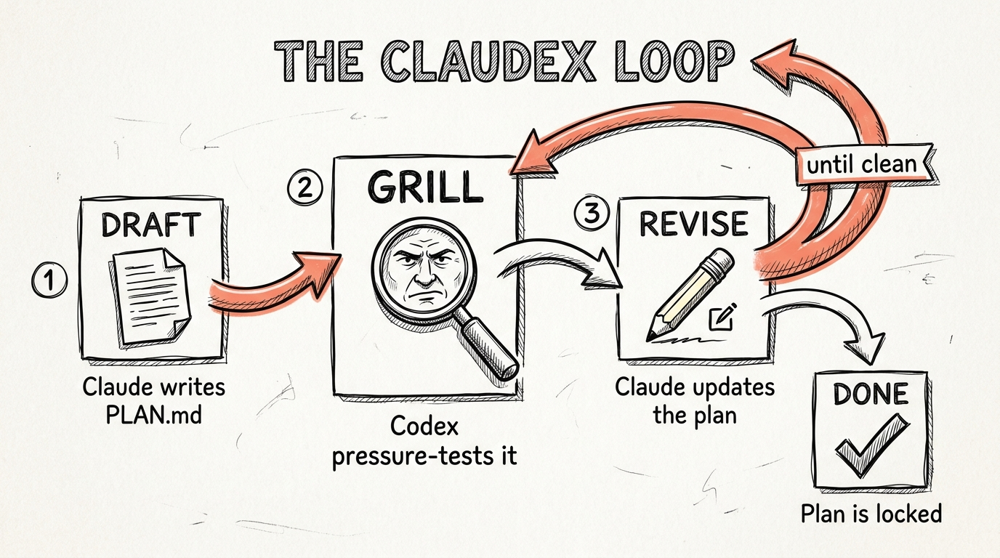
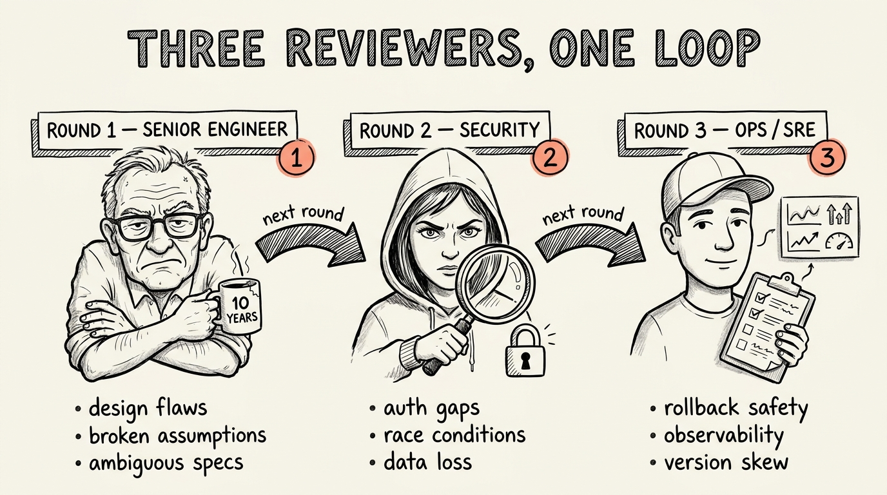

<h1 align="center">claudex</h1>

<p align="center">
  <strong>Autonomous Claude + Codex review loop for Claude Code.</strong><br/>
  Plan a feature with adversarial pushback. Audit code with a fresh pair of eyes.<br/>
  All in one Claude Code session, hands off the keyboard.
</p>

<p align="center">
  
</p>

<p align="center">
  <a href="https://www.skool.com/earlyaidopters/about">
    
  </a>
</p>

<p align="center">
  <sub>
    The GitHub repo is the v1 teachable artifact. The actively-maintained build with new features, fixes, and supporting workflows lives in the <a href="https://www.skool.com/earlyaidopters/about">Early AI-dopters</a> community.
  </sub>
</p>

<p align="center">
  <a href="https://www.skool.com/earlyaidopters/about"></a>
  <a href="https://github.com/promptadvisers/claudex"></a>
  <a href="https://github.com/promptadvisers/claudex/blob/main/LICENSE"></a>
</p>

---

```
$ /claudex:plan add expiry dates to my links

  Want me to interview you to sharpen the topic, or just go?
    → Interview me first
    → Just launch the loop

  Round 1 of 3 — Senior-engineer review
        Codex: 5 findings (2 high, 3 medium)
  Round 2 of 3 — Security and data-integrity review
        Codex: 1 high, 1 low
  Round 3 of 3 — Ops and SRE review
        Codex: no substantive findings
  LGTM. Plan locked.

  Plan: PLAN.md
  Log:  .claude/claudex/<id>.log
```

You typed one command. You watched three different reviewer personas grill the plan from three different angles until there was nothing left to grill. You walked away with a vetted plan. You did not touch the keyboard between the first command and the final output.

That's claudex.

---

## What it actually is

Two slash commands wired through a Claude Code Stop hook, plus four utility commands. The Stop hook is the only mechanism in Claude Code that can force an autonomous loop. Claudex uses it to drive Claude and Codex back and forth until the work is done.

| Command | Mode | Behavior |
|---|---|---|
| `/claudex:plan [flags] <feature>` | Plan mode | Optionally interviews you to sharpen the topic, then Claude drafts `PLAN.md`, Codex pressure-tests it, Claude revises. Each round uses a different reviewer persona. Loops until LGTM or N rounds. |
| `/claudex:review` | Review mode | Codex reviews the diff. Findings + proposed fixes written to `reviews/`. **Read-only in v1.** |
| `/claudex:status` | — | Print the current loop's mode, phase, round, elapsed time, and per-round severity tallies. Read-only. |
| `/claudex:doctor` | — | Preflight diagnostic. Verifies bash, codex CLI, plugin file integrity, hook fail-open. Run after install. |
| `/claudex:cancel` | — | Graceful cancel of the active loop. |
| `/claudex:rollback` | — | Nuclear cleanup of all state files. |

### Plan-mode flags

| Flag | Effect |
|---|---|
| `--rounds N` | Override the default max rounds (3). Common picks: 3 (default, fast), 5 (deeper grilling), 7+ (very high stakes). |
| `--from-draft` | Use the existing `PLAN.md` in the project root instead of drafting from scratch. PLAN.md must exist and be non-empty. |
| `--skip-interview` | Skip the topic-sharpening interview offer and launch the loop immediately. |

### Examples

```
/claudex:plan add expiry dates to my links                       # default 3 rounds, interview offered
/claudex:plan --rounds 5 migrate auth to Clerk                   # 5 rounds, deeper grilling
/claudex:plan --from-draft refactor the billing pipeline         # use existing PLAN.md
/claudex:plan --skip-interview --rounds 3 fix the auth bug       # skip the interview offer
```

## Why this is different from solo Claude or solo Codex

Most "AI loop" plugins for Claude Code only do code review. Plan mode is the bigger unlock — having Codex pressure-test a *design* before you write a line of code is the move that compounds the most over time. Two rounds and your plan is bulletproof. You haven't written any code. That's the magic.

And the rounds aren't identical. Each round flips Codex into a different reviewer:



- **Round 1 — Senior engineer.** Hunts for design flaws and broken assumptions.
- **Round 2 — Security and data integrity.** Auth gaps, race conditions, partial-failure recovery, data loss.
- **Round 3+ — Ops and SRE.** Rollback safety, observability, gradual rollout, version skew.

If `--rounds N` pushes past three, the ops persona deepens on subsequent rounds rather than going generic.

## Prerequisites

Before installing claudex, you need:

| Requirement | Why | How to get it |
|---|---|---|
| **Claude Code** | Where claudex runs | https://docs.claude.com/en/docs/claude-code |
| **Node.js 18.18+** | Codex CLI is a Node app | https://nodejs.org/ or use `nvm` |
| **Codex CLI** | claudex calls `codex exec` directly | `npm install -g @openai/codex` |
| **ChatGPT Plus or higher** | Codex authenticates against your ChatGPT account | https://chatgpt.com/ |
| **Bash** | Hooks and scripts are bash | Built into macOS and Linux. Windows needs WSL. |
| **`codex login`** | Authenticates the Codex CLI | Run `codex login` after install (opens a browser) |

### Recommended companion (not required)

[`openai/codex-plugin-cc`](https://github.com/openai/codex-plugin-cc) — the official Codex plugin for Claude Code. Adds `/codex:review`, `/codex:adversarial-review`, `/codex:rescue`, and `/codex:setup` slash commands.

To install:

```
/plugin marketplace add openai/codex-plugin-cc
/plugin install codex@openai-codex
/reload-plugins
/codex:setup
```

claudex works without it (we invoke `codex` CLI directly), but pairing them is the full experience.

## Install

### Quick path (one command checks everything)

```bash
git clone https://github.com/promptadvisers/claudex.git ~/claudex
cd ~/claudex
bash install.sh
```

`install.sh` walks through every prerequisite, installs the Codex CLI if it's missing, points you at `codex login` if needed, and runs the platform validation tests at the end. Re-runnable any time you want to recheck the setup.

After it reports green, drop the plugin into your project:

```bash
# inside your project root, in a Claude Code session:
cp -r ~/claudex .claude/plugins/claudex
/reload-plugins
```

Or symlink it instead so updates stay in sync:

```bash
mkdir -p .claude/plugins
ln -s ~/claudex .claude/plugins/claudex
/reload-plugins
```

### Verify

```bash
/claudex:doctor
```

That runs the preflight check inside Claude Code. If anything is red, fix it before running a real loop. The same diagnostic also runs as a shell script:

```bash
bash .claude/plugins/claudex/scripts/doctor.sh
```

## Try it

In a Claude Code session inside any git project:

```
/claudex:plan add a feature flag system to this app
```

Pick "Interview me first" when prompted, answer three short questions, and watch the loop. Claude drafts `PLAN.md`. The Stop hook fires when Claude tries to finish the turn. The hook writes a runner script that calls Codex with the round-1 senior-engineer prompt. Claude executes the script, reads Codex's findings, and either revises `PLAN.md` (if there are material findings) or marks the loop done.

You watch all of it happen in one Claude Code window.

## How it works (the 60-second version)

```
USER /claudex:plan <topic>
   ↓
Slash command optionally interviews user, writes state file, tells Claude to draft PLAN.md
   ↓
Claude drafts PLAN.md, tries to finish turn
   ↓
Stop hook fires → BLOCK with "run the runner script"
   ↓
Claude runs the runner → Codex returns adversarial findings (round-N persona)
   ↓
Claude reads findings: revise PLAN.md OR call mark-done
   ↓
Try to finish turn again
   ↓
Stop hook fires → check signal:
   - no-material-findings  → ALLOW, print final summary
   - max rounds hit        → ALLOW, print remaining concerns
   - else                  → increment round, rotate persona, BLOCK with new round
```

The Stop hook is fail-open everywhere. Any error returns `{"decision":"approve"}` so the user can never get trapped. Read [`docs/ARCHITECTURE.md`](plugins/claudex/docs/ARCHITECTURE.md) for the full breakdown.

## Configuration

| Variable | Default | What it does |
|---|---|---|
| `CLAUDEX_MAX_PLAN_ROUNDS` | 3 | Max plan-loop rounds before stopping |
| `CLAUDEX_MAX_REVIEW_ROUNDS` | 3 | Max review-loop rounds (v2) |
| `CLAUDEX_STALE_MINUTES` | 15 | Loops older than this are auto-swept on next invocation |
| `CLAUDEX_STATE_DIR` | `.claude/claudex` | State directory location |

## Cost expectation

Each plan-mode round is one full Codex review of `PLAN.md`. In practice that's ~25–30k Codex tokens per round. With the default 3 rounds you should expect **~75–90k tokens per `/claudex:plan`**. Codex authenticates against your ChatGPT account, so the bill goes to your ChatGPT Plus / Pro / Team / Enterprise plan, not to claudex. If you're on a tight rate limit, run `--rounds 2` for fast topics and reserve `--rounds 5+` for high-stakes designs.

## Safety

The plugin is designed to fail open everywhere. You can never get trapped in a broken loop. See [`docs/SAFETY.md`](plugins/claudex/docs/SAFETY.md) for the complete list of what claudex does and does NOT do.

Highlights:

- Hook fails open on every error (ERR trap installed at the top)
- Plan mode only writes to `PLAN.md` and `.claude/claudex/`
- **Review mode v1 is read-only** — does NOT edit your code
- Concurrent loops detected and refused (phase-based, not file-presence)
- Stale loops auto-cleaned after 15 min
- Atomic state writes (tmp + rename)
- CAS phase transitions prevent race conditions

## Documentation

- [`docs/ARCHITECTURE.md`](plugins/claudex/docs/ARCHITECTURE.md) — full technical walkthrough. Loop lifecycle, state machine, fail-open patterns.
- [`docs/SAFETY.md`](plugins/claudex/docs/SAFETY.md) — explicit guarantees and non-guarantees. Read before installing.
- [`docs/V2_DESIGN.md`](plugins/claudex/docs/V2_DESIGN.md) — design for v2 auto-apply review mode (not built in v1).

## Tests

```bash
# Phase 0: confirm platform behaviors work on your machine (50 checks)
bash plugins/claudex/tests/platform-validation.sh

# Smoke test: simulate full lifecycle without invoking Codex (60 checks)
bash plugins/claudex/tests/smoke-test.sh

# Synthetic E2E: real Codex calls against a throwaway repo (19 checks, costs a few cents in tokens)
bash plugins/claudex/tests/synthetic-e2e.sh
```

All three should pass before trusting claudex on a real project.

## Project structure

```
claudex/
├── .claude-plugin/marketplace.json   # Marketplace manifest
├── plugins/claudex/
│   ├── .claude-plugin/plugin.json    # Plugin manifest
│   ├── commands/
│   │   ├── plan.md                   # /claudex:plan (with interview)
│   │   ├── review.md                 # /claudex:review
│   │   ├── status.md                 # /claudex:status
│   │   ├── doctor.md                 # /claudex:doctor
│   │   ├── cancel.md                 # /claudex:cancel
│   │   └── rollback.md               # /claudex:rollback
│   ├── hooks/
│   │   ├── hooks.json                # Stop hook registration
│   │   └── stop-hook.sh              # Lifecycle engine, fail-open everywhere
│   ├── scripts/
│   │   ├── start-loop.sh             # Sets up state, refuses concurrent loops
│   │   ├── mark-done.sh              # Claude calls this to signal LGTM
│   │   ├── status.sh                 # Implements /claudex:status
│   │   ├── doctor.sh                 # Implements /claudex:doctor
│   │   ├── cancel-loop.sh
│   │   ├── rollback-loop.sh
│   │   ├── state-helpers.sh          # Atomic write, CAS, sweeper, lockfile
│   │   ├── personas.sh               # Reviewer personas per round
│   │   └── prompts/                  # Templated instructions
│   ├── tests/
│   │   ├── platform-validation.sh
│   │   ├── smoke-test.sh
│   │   └── synthetic-e2e.sh
│   └── docs/
└── docs/images/                      # README hero diagrams
```

## Troubleshooting

**`/claudex` doesn't show up in my slash command list.**
You either skipped `/reload-plugins` after dropping the plugin in, or the plugin folder isn't where Claude Code expects it. Confirm `.claude/plugins/claudex/.claude-plugin/plugin.json` exists. Then run `/reload-plugins`.

**`codex exec` errors out with "auth required" or similar.**
Run `codex login` in a regular terminal. It opens a browser. Sign in with your ChatGPT account (Plus or higher).

**`/claudex:doctor` flags something red.**
Doctor names the failing check explicitly. Common ones: `codex` not in PATH (install the CLI), state directory not writable (check permissions), plugin file missing (re-clone or `/reload-plugins`).

**The hook fires but Claude doesn't continue the loop.**
Check `.claude/claudex/log` for ERR-trap entries. Most likely cause: the runner script printed an error from the Codex CLI. Run `bash .claude/claudex/<id>-runner.sh` manually to see what Codex said.

**A loop is stuck and `/claudex:cancel` didn't help.**
Use `/claudex:rollback` to nuke all state files. Then start a fresh loop.

**I want to debug what the hook is doing.**
Set `CLAUDEX_VERBOSE=1` in your environment before invoking `/claudex`. Logs will be more detailed in `.claude/claudex/log`.

## License

MIT. See [`LICENSE`](LICENSE).
